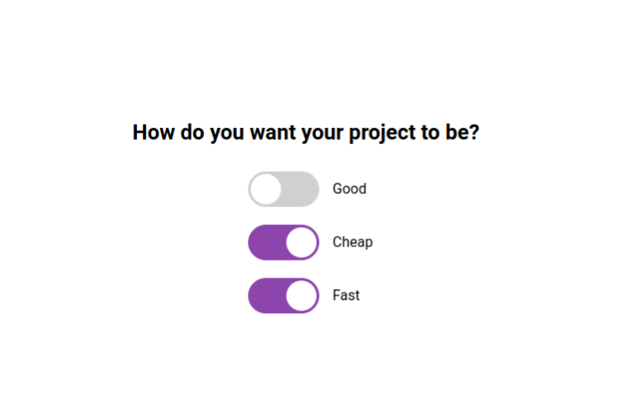

# Checkboxes / Sliders

1. Styling the checkboxes with HTML/CSS like animated slider widgets

2. Adding JavaScript logic:
   2.1 The user can only check 2 out of 3 checkboxes
   (The App doesn't allow the options Good, Cheap and Fast at the same time!) ## Screenshots

